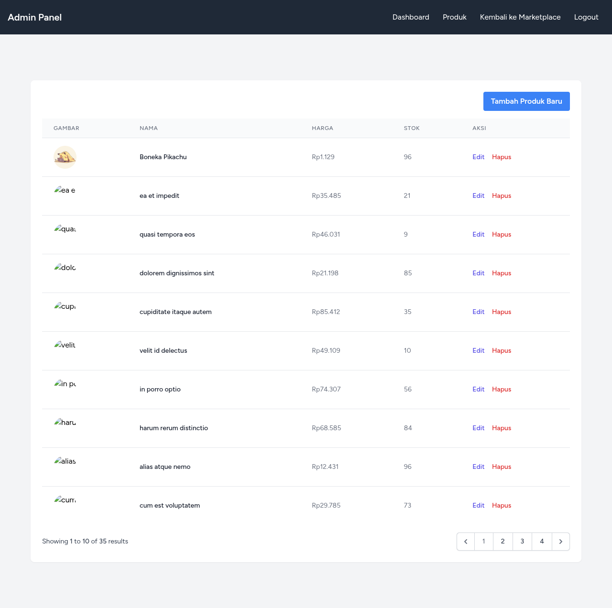
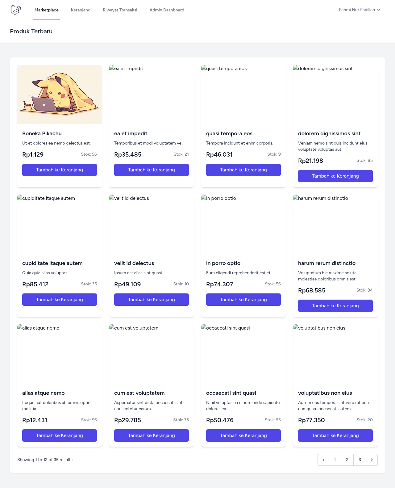
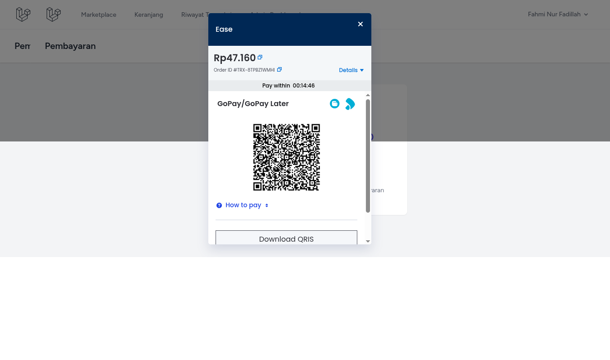
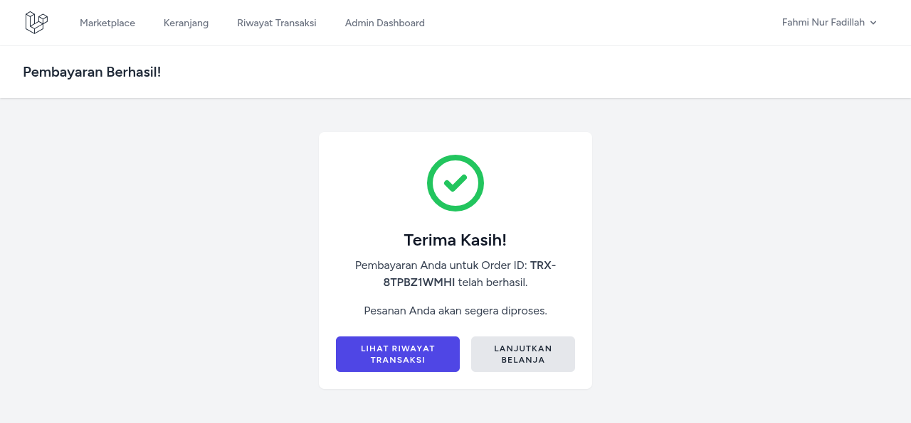
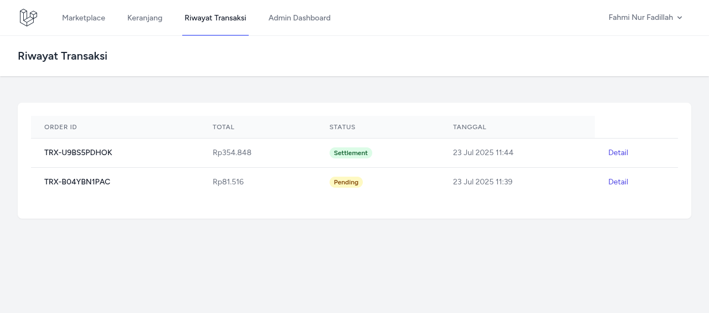

# 🛍️ Proyek Laravel Marketplace Sederhana

Aplikasi Marketplace sederhana berbasis **Laravel 12**, menggunakan **Blade template**, **Tailwind CSS**, **Font Awesome**, dan integrasi **Midtrans Sandbox** untuk simulasi pembayaran. Aplikasi ini memiliki 2 role utama: **Admin** dan **User**, dengan fitur transaksi penuh, dashboard interaktif, dan tampilan modern.


## 🖼️ Screenshot Tampilan Aplikasi

<table>
  <tr>
    <td align="center">
        
        <strong>Admin Panel</strong>
    </td>
    <td align="center">
        
        <strong>Marketplace</strong>
    </td>
  </tr>
  <tr>
    <td align="center">
        
        <strong>Midtrans Payment</strong>
    </td>
    <td align="center">
        
        <strong>Success Payment</strong>
    </td>
  </tr>
  <tr>
    <td colspan="2" align="center">
        
        <strong>Transaction History</strong>
    </td>
  </tr>
</table>

---

## ✨ Fitur Utama

### 👤 Role & Akses
- **Admin**
  - Dashboard interaktif (Chart.js) memantau penjualan & keuntungan
  - CRUD Produk (nama, deskripsi, harga, stok, gambar)
  - Monitoring transaksi & status pembayaran
- **User**
  - Melihat produk, menambahkan ke keranjang
  - Checkout dan melakukan pembayaran (Midtrans)
  - Riwayat transaksi

### 💳 Fitur Transaksi
- Cart logic menggunakan Laravel Session
- Checkout langsung melalui Midtrans Snap (sandbox)
- Webhook otomatis untuk update status transaksi
- History transaksi dengan status (Pending, Paid, Failed)

### 📊 Dashboard Admin
- Dilengkapi grafik statistik penjualan
- Total transaksi berhasil
- Total keuntungan per bulan
- Produk terlaris

### 🎨 Frontend
- Tailwind CSS
- Font Awesome Icons
- Blade templating
- UI modern dan responsif

---

## 🚀 Cara Install

```bash
git clone https://github.com/Cs-Blu3Eye/laravel-marketplace.git
cd laravel-marketplace

# Install dependency
composer install
npm install && npm run dev

# Copy env & generate app key
cp .env.example .env
php artisan key:generate

# Set database di .env
# DB_DATABASE=laravel_marketplace

# Jalankan migrasi & seeder
php artisan migrate --seed

# Jalankan server lokal
php artisan serve
````

---

## 🔐 Login Akun

### 👑 Admin

* **Email**: `admin@example.com`
* **Password**: `password`

### 👤 User Biasa

* Dibuat otomatis oleh `factory`, login bisa menggunakan email dari tabel `users`
* Contoh: `user1@example.com` (lihat di database)

> **Catatan**: Semua akun bisa melakukan transaksi, termasuk admin.

---

## 💰 Integrasi Midtrans (Sandbox)

1. Daftar di: [https://sandbox.midtrans.com](https://sandbox.midtrans.com)
2. Ambil:

   * **Client Key**
   * **Server Key**
3. Tambahkan di `.env`:

```env
MIDTRANS_SERVER_KEY=YOUR_SERVER_KEY
MIDTRANS_CLIENT_KEY=YOUR_CLIENT_KEY
MIDTRANS_IS_PRODUCTION=false
```

4. Setup webhook:

   * URL: `http://localhost:8000/midtrans/callback`
   * Method: `POST`

---

## 📂 Struktur Folder Penting

```
├── app/
│   ├── Http/
│   │   ├── Controllers/
│   │   └── Middleware/
├── database/
│   ├── factories/
│   ├── migrations/
│   └── seeders/
├── resources/
│   ├── views/
│   │   ├── admin/
│   │   ├── user/
│   │   └── layouts/
├── public/
│   └── img/
│       └── img1.png
```

---

## 📈 Fitur Pengembangan Berikutnya

* 📍 Penambahan lokasi pembeli (Google Maps / Select Region)
* ⚡ Optimalisasi performa frontend/backend
* 🔔 Notifikasi real-time status pembayaran
* 🧾 Export laporan ke PDF/Excel

---

## 🧑‍💻 Kontribusi

Pull request dan kritik sangat diterima. Pastikan coding mengikuti standar Laravel dan tailwind utility-first approach.

---

## 📄 Lisensi

MIT License © 2025 [Cs-Blu3Eye](https://github.com/Cs-Blu3Eye)
